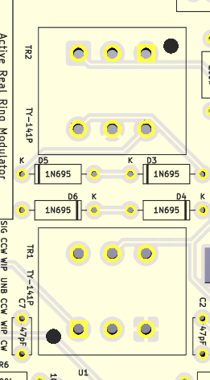

# Active Real Ring Modulator build notes

## Erratum

On the first PCB run, the transformer footprints are incorrect; mainly the problem is the dots indicating pin 1 are in the wrong place. They should look like this:

Place the dot side of the transformer toward the bottom for TR1 and toward the top for TR2.

This was corrected after the first run.
