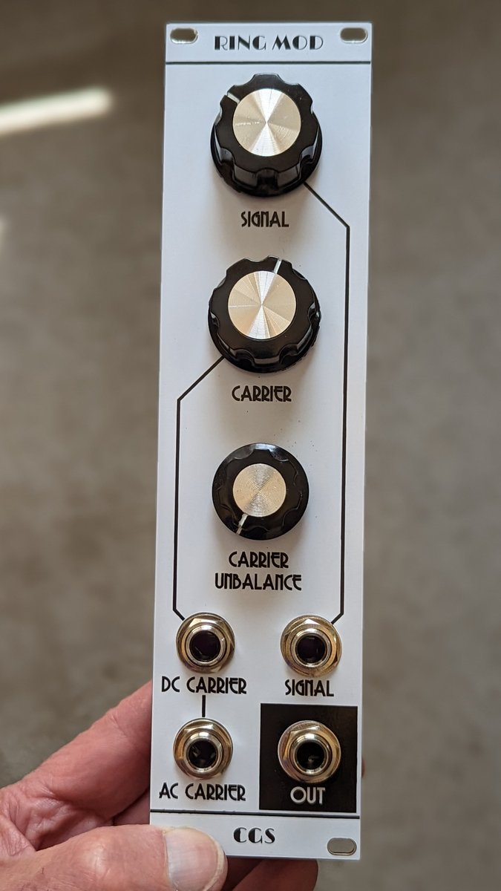
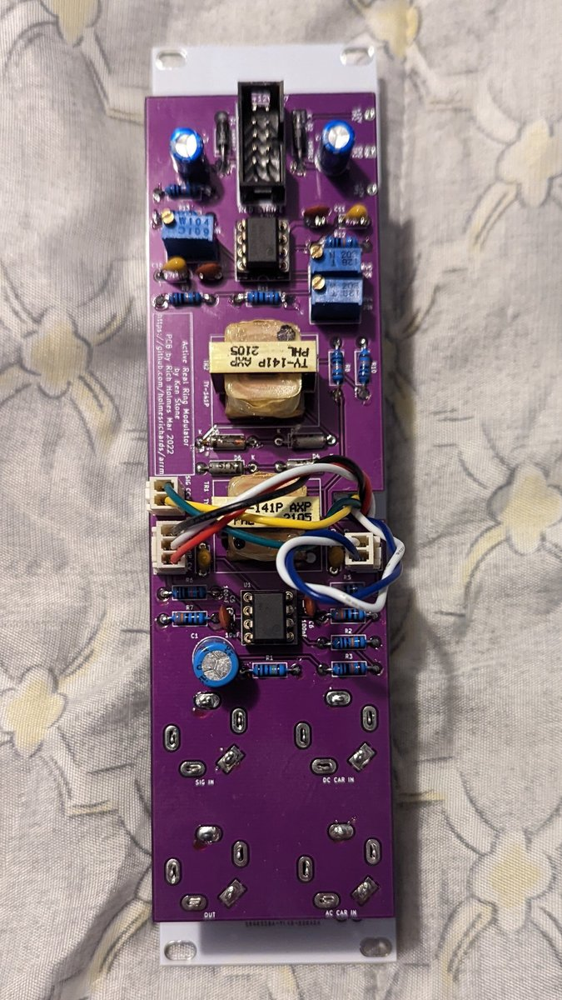

# Active Real Ring Modulator

This is a Kosmo format synth module based on Ken Stone's CGS [https://sdiy.info/wiki/CGS_active_real_ring_modulator](Active Real Ring Modulator). 

Main difference with Stone's original are:

* The instrument preamplifier was omitted
* Transformer footprints are for the TY-141P instead of the less available MO222
* Final stage input resistor is decreased to 10k, output resistor is increased to 1k, and a 100k pulldown is added on the output.

## Current draw
11.5 mA +12 V, 11.5 mA -12 V


## Photos





## Documentation

* [Schematic](Docs/arrm.pdf)
* PCB layout: [front](Docs/arrm_layout_front.pdf), [back](Docs/arrm_layout_back.pdf)
* [BOM](Docs/arrm_bom.md)
* [Build notes](Docs/build.md)
* [Blog post](https://analogoutputblog.wordpress.com/2022/05/05/cgs-ken-stone-active-real-ring-modulator/)

## GitHub repository

* [https://github.com/holmesrichards/arrm](https://github.com/holmesrichards/arrm)

## Submodules

This repo uses submodules aoKicad and Kosmo_panel, which provide needed libaries for KiCad. To clone:

```
git clone git@github.com:holmesrichards/arrm.git
git submodule init
git submodule update
```


Alternatively do

```
git clone --recurse-submodules git@github.com:holmesrichards/arrm.git
```

Or if you download the repository as a zip file, you must also click on the "aoKicad" and "Kosmo\_panel" links on the GitHub page (they'll have "@ something" after them) and download them as separate zip files which you can unzip into this repo's aoKicad and Kosmo\_panel directories.

If desired, copy the files from aoKicad and Kosmo\_panel to wherever you prefer (your KiCad user library directory, for instance, if you have one). Then in KiCad, go into Edit Symbols and add symbol libraries 

```
aoKicad/ao_symbols
Kosmo_panel/Kosmo
```
and go into Edit Footprints and add footprint libraries 
```
aoKicad/ao_tht
Kosmo_panel/Kosmo_panel.
```
